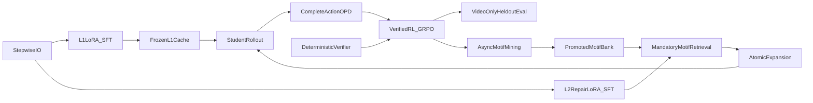

# Video Skills：SFT LoRA + OPD + Verified RL 实施计划

## 设计结论

推荐使用 SFT LoRA + OPD，但不能把 OPD 设计成“只选 tool，RL 再学 arguments”。每个 OPD 候选必须是完整可执行动作 `a_t=(skill_type, skill_name, arguments)`；OPD 只负责在 student 自己走到的边界状态上提供 teacher policy prior，最终仍由 execution + deterministic verifier 驱动的 RL 决定哪些动作真正有效。

首版模块配置：

采用 **五张独立 LoRA**，不要共享 L2/Repair adapter：

- L1：独立 LoRA，路线为 `SFT → 冻结 substrate → 后期可选 joint GRPO`；首轮不做 OPD。
- L2：独立 LoRA，路线为 `SFT → complete-action OPD → verified RL`。
- Repair：独立 LoRA，路线为 `SFT → complete-action OPD → verified RL`；与 L2 联合 rollout，但权重分离。
- Verifier：[`runtime_verifier.py`](../dataset_clip_wrapper/verification/runtime_verifier.py) 保持冻结的确定性硬门；9B semantic verifier 采用反事实 SFT + OPD + calibration，GPT-5-mini 只升级处理校准后仍模糊的案例。learned verifier 与 teacher 都不直接产生主 RL reward。
- Motif：**必选核心模块**。9B online manager 采用 lifecycle/retrieval SFT + action-level OPD；每次在线 L2 推理都必须检索 Motif bank，经可选 GPT-5-mini rerank 后展开为 atomic skills，再执行并重新验证。检索失败或 motif 无效时允许显式 fallback，但不能跳过检索步骤。GPT-5-mini 负责异步 candidate extraction/curation，promotion 仍由 evidence audit、跨视频支持和 paired rollout 门控。
- **GRPO 算力**：正式 verified RL 默认 **8×A6000**（§7.0）；框架加速（vLLM / ms-swift / verl）按 §7.A 做 profile→spike→迁主环门槛，不预先否定也不默认迁栈。

### SFT / OPD / RL 的能力边界

五个 LoRA 的 SFT 首先是 **syntax / schema / action-space warm-up**，不是最终模块能力训练：

```text
SFT         = 学会稳定地产生合法、完整、可路由的结构化 action
OPD         = 在 student-induced states 上学习完整 action 的偏好、参数绑定与恢复策略
Verified RL = 用实际执行 + verifier 的终局结果优化 episode policy
```

- L1 数据较多，SFT 可能同时学到实质构图能力；其余 LoRA 尤其 Repair、Verifier、Motif 的 SFT 主要验收格式和动作覆盖。
- SFT 后不要求 Repair conversion、Verifier 语义可靠性或 Motif downstream utility 已经提升；这些功能门放在 OPD（以及必要时 Verified RL）之后。
- 五 LoRA 隔离了跨模块的行数不平衡，但没有消除每个包内部的多数动作偏斜。训练时仍需按 action family / label 分层采样或加权。

### 首轮为何冻结 L1，以及 L1 输出什么

“冻结 L1”只表示首轮 OPD / RLVR **不更新 L1 LoRA 参数**，不表示 L1 graph
不可修改，也不禁止 Repair 请求新感知或写入受控 patch。

首轮冻结的理由：

1. 固定 L2 / Repair 所面对的 evidence substrate，使 retrieval failure 与 reasoning failure 可归因；
2. 避免把一个终局 reward 模糊分配给大量 L1 node/edge 动作和后续 L2 动作；
3. 防止联合 RL 诱导 L1 生成迎合选项、但没有视觉 provenance 的“证据文本”；
4. 允许同一 source video 的多个问题复用一次 question-blind L1 cache，降低训练成本。

L1 输出不是答案，而是结构化 `ClueMemoryGraph` / evidence cache，核心字段包括：

```json
{
  "graph_id": "clue_memory:<example_id>",
  "video_id": "<source_video_id>",
  "video_regime": "short|long|streaming",
  "clip_policy": {
    "strategy": "hierarchical",
    "coarse_window_s": 30,
    "fine_window_s": 8
  },
  "index_stats": {
    "node_count": 0,
    "coarse_clip_count": 0,
    "fine_clip_count": 0
  },
  "nodes": [
    {
      "node_id": "obs:<id>",
      "node_type": "observation|event|entity|state|clip",
      "text": "<visible video observation>",
      "clip_id": "clip:<video>:fine:<index>",
      "time_span": {"start_s": 0, "end_s": 8},
      "modality": "visual",
      "confidence": 0.0,
      "provenance": {"created_by": "<perception backend>"}
    }
  ],
  "edges": [
    {"src": "<node_id>", "dst": "<node_id>", "relation": "<typed relation>"}
  ],
  "retrieval": {"topk": 2},
  "trust_policy": {}
}
```

`video_only` L1 输出不得包含 gold answer、official clue interval、official
reasoning 或 dataset explanation。所有可用于 commit 的证据必须保留
`node_id + clip_id + time_span + modality + provenance`。

L2 不在每一步接收完整图序列化，而是接收有界 context：

```text
question
  + coarse summary catalog
      (coarse_index, time_span, scene_description,
       observable_facts, events, searchable_phrases)
  + selected fine evidence
      (node_id, clip_id, time_span, text, entity/event/state,
       confidence, provenance, graph relations)
  + partial L1 summary / evidence gaps / remaining budget
  + prior L2 and repair round summaries
```

Repair 可在 L1 权重冻结时进行 episode-local 增量更新：

```text
frozen L1 cache
  + repair request (reinspect / select new clip / patch)
  + perception output
  + schema/ref/provenance-validated L1 graph delta
  -> updated episode-local L1 graph
```

只有在 L2 + Repair RLVR 稳定、能够区分 evidence failure 与 reasoning
failure、并建立独立 L1 evidence recall/precision 指标后，才进行小学习率
joint L1 experiment。joint 结果必须与 frozen-L1 baseline 在相同 split、
budget 和 evaluator 下比较。



## 1. 固化数据角色与不可破坏规则

详细 dataset 角色、Video-Holmes 难度定位、比例与 `split_manifest` 落地见
[`video-skills-data-split-plan.md`](video-skills-data-split-plan.md)。

- 扩展 [`build_training_manifests.py`](../dataset_clip_wrapper/manifests/build_training_manifests.py)，先按 source-video group 固定划分 `sft_seed`、`opd_pool`、`grpo_pool`、`dev_tune`、`heldout_test`；同一 video/trajectory/motif source 不得跨角色。
- 保留 [`sft_common.py`](../dataset_clip_wrapper/training/sft_common.py) 的 forbidden prompt keys；official answer、clue interval、reasoning process 只能进入 evaluator，不能进入 `state_t`。
- VRBench、VideoMME、OVO-Bench 保持 eval-only；CG-Bench 作冷启动主 ramp，Video-Holmes 作硬课/终评（早期 L2/RL 勿以 VH 为主成功门）。
- 新增 `dataset_clip_wrapper/training/build_posttraining_manifest.py`，记录 split role、rollout ID、policy checkpoint、reward spec、teacher model、candidate-order seed、artifact hash，保证 OPD/RL 可复现。
- 为现有 [`build_specialist_sft_v3.py`](../scripts/sft_pilot/build_specialist_sft_v3.py) 增加 post-training manifest 输出，但不改变现有 v3 artifact。

退出门：所有 role group overlap 为 0、forbidden key 命中为 0、eval-only 数据训练行数为 0、每条记录可追溯到 source video 与生成 checkpoint。

## 2. 生成适合训练的细粒度 SFT 数据

- L1 沿用 builder/patch 数据，但 sampler 按 create-node、edge、anchor、segment、patch、skip family 归一化，不按原始 15,690 行直接采样。
- 扩展 [`l2_specialist_sft_adapter.py`](../dataset_clip_wrapper/training/l2_specialist_sft_adapter.py)，新增 gated `extract_claim`、`assign_evidence_role`、`compose_evidence_chain`、`compare_hypotheses`、`commit/abstain` transitions；正例必须同时通过 correctness 与 option/runtime verifier。
- 扩展 [`repair_report_stepwise_sft_adapter.py`](../dataset_clip_wrapper/training/repair_report_stepwise_sft_adapter.py)，把 round-level repair 拆成 diagnose、inspect、patch/reroute、re-verify、commit/abstain；每一步只暴露决策时已可见状态。
- Verifier 数据通过“删除关键证据、替换错误 ref、打乱时间关系、加入 lexical distractor”生成可执行 hard negatives；标签由确定性检查得到，不由另一个 learned judge 自报。
- Motif 数据继续由 [`promotion.py`](../dataset_clip_wrapper/motifs/promotion.py) 和 [`expansion.py`](../dataset_clip_wrapper/motifs/expansion.py) 管理；除 lifecycle/audit 外，必须记录在线 retrieval、rerank、expansion、fallback 和 downstream verification transitions。Motif 本身仍不是 atomic skill，执行前必须展开。

首版 sampler 目标：L1 35%，L2 正常推理 32%，Repair 8%，Verifier 20%，Motif 5%；这是训练采样分布，不要求物理复制数据。L2 gated core 与 derived 数据分开统计，core 至少 3 倍采样权重。

数据退出门：每种 action family 在 train/dev 都有覆盖；L2 core 与 derived 分开报告并提高 core 采样权重；Repair dev 覆盖主要 failure taxonomy；Verifier 在 CG/VH 均有 supported/insufficient 与反事实 hard negatives。此处保证 OPD 候选和状态有数据基础，不要求 SFT 已解决终局任务。

## 2.5 SFT 启动前 Preflight（硬门）

在训练任何 LoRA 之前，必须按顺序完成：

1. 生成不可变 [`build_split_manifest.py`](../dataset_clip_wrapper/training/build_split_manifest.py) 产物 `split_manifest_v1.json`。
2. 只用 `sft_seed` / `dev_tune` 重建 `specialist_sft_v4/`；保留 v3 作历史对照，不直接开训。
3. 运行 [`evaluate_sft_package_gates.py`](../dataset_clip_wrapper/training/evaluate_sft_package_gates.py)：
   - prompt forbidden key hits = 0
   - eval-only rows = 0
   - assistant JSON parse rate = 1.0
   - chat roles 必须是 system/user/assistant
   - 非 motif 行尽量可映射到 split_manifest video key
   - 非 `sft_seed`/`dev_tune` 视频行 = 0
   - top1 family share 过高时必须启用 family-weighted sampling（warning → train-time 强制）
4. 为每张 LoRA 保存 base-9B generation baseline 与 majority-action baseline。
5. 每张 LoRA 先跑 tiny overfit smoke（32–128 行），确认 chat template、assistant-only loss、LoRA 加载与 checkpoint 恢复正常。

Preflight 未通过时禁止启动正式 SFT。

## 3. 完成五 LoRA SFT 格式与动作空间 cold start

- 复用 [`train_lora_sft.py`](../dataset_clip_wrapper/training/train_lora_sft.py)，分别训练五张独立 LoRA：L1、L2、Repair、Verifier、Motif。
- 训练时读取各包 `source_family_weight` / sampling config，按 action family 分层，避免多数类塌缩。
- Verifier LoRA 输出 `supported/insufficient/contradictory` + failure code；线上 acceptance 仍以 deterministic invariants 为硬门。
- Motif LoRA 只做 retrieval/lifecycle/fallback 格式 warm-up；promotion 与 utility 仍走证据门与 paired rollout。
- 每张 LoRA 写出：
  - `generation_report.json`
  - `base_generation_report.json`
  - `train_metrics.json`
  - checkpoint + adapter config hash

### SFT 后质量门（[`evaluate_lora_sft_gates.py`](../dataset_clip_wrapper/training/evaluate_lora_sft_gates.py)）

只验证 warm-up 是否合格；功能指标留给 OPD：

| 检查 | 默认门槛 | 含义 |
|---|---|---|
| hidden leakage | 0 | prompt 无 gold/hidden keys |
| json_valid_rate | ≥ 0.95 | 稳定输出可解析 JSON action |
| action_match_rate | ≥ 0.50 | 至少学到动作空间，不是乱输出 |
| beat base-9B json_valid_rate | 必须 | SFT 相对 base 有格式收益 |
| beat majority-action baseline | 必须 | 不是只拟合众数动作 |
| tiny-overfit / schema route | 通过 | adapter 真的改变了生成行为 |

判定规则：

- 任一 specialist 未过门 → 该 LoRA **不得进入 OPD**；
- 若只超过 base、未超过 majority → 记为 majority-class collapse，先修采样/数据再重训；
- Repair conversion、Verifier false-supported、Motif paired utility、L2 verified terminal success **不是本阶段退出门**。

## 4. 实现强制 Motif 在线闭环

Motif 在线采用 **dual loop**（同一 bank、两种触发），实现见 [`motif/dual_loop.py`](../motif/dual_loop.py) 与 [`reasoning_planner.py`](../dataset_clip_wrapper/l2_reasoning_graph/reasoning_planner.py)：

### 4.A Accelerate（开局，强制）

- 在 L2 controller 每个 episode 开始时强制执行 `retrieve_motif_candidates`（`motif_phase=accelerate`）；查询输入含 question type、L1 graph summary、evidence gaps 与 budget，并记录 bank version。
- **Accelerate 池只允许 `verified` / `active`**；`candidate` / `shadow` 不得用于跳过 LLM planner 的加速路径。
- 对检索候选执行 evidence-safety 与 compatibility 过滤；GPT-5-mini 可在 top-k 内 rerank，但只能看到当前可见 state，不得访问 gold answer、hidden clue 或 held-out metadata。
- 选中的 motif 必须经 [`online_expand.py`](../motif/online_expand.py) / [`expansion.py`](../dataset_clip_wrapper/motifs/expansion.py) 展开为现有 atomic skill nodes；禁止直接执行 motif 黑盒或创建新的在线 skill ID。
- expansion 后的每个 atomic action 走普通 executor 与 deterministic verifier；任一 ref、visibility 或 schema gate 失败时，标记 motif failure 并回退到无 motif 的普通 L2 planning，而不是阻断整个 episode。

### 4.B Failure → repair motif → mine（可选二次检索）

- 当首轮 plan（motif 或 LLM）执行出现可修复失败时：先跑模板 `fault_repair`；若仍无成功 `commit_answer`，再按 failure taxonomy / evidence gaps 做 **二次 retrieve**（`motif_phase=repair`）。
- Repair 检索可包含 `shadow` / `candidate`（仅作修复先验），展开后同样走 atomic executor + verifier；不得把裸失败轨迹直接写入 bank。
- 仅当 **repair 路径贡献后** 且 rollout 达到 verified terminal success（`accepted_strong` / `resolved_strong` + runtime verifier pass）时，才把 **repaired skill sequence** 异步写入 `candidate`（`candidate_mined=true`）。GPT-5-mini 可提候选，但只能进 `candidate/shadow`。
- Promotion 仍必须满足 evidence audit、跨 source-video 支持、可展开性和 paired rollout 门槛；**OPD / GRPO reward 不决定 promotion**。

### 4.C 日志与退出门

- 在线日志字段：`motif_retrieval_attempted`、`candidate_ids`、`selected_motif_id`、`bank_version`、`expansion_valid`、`fallback_reason`、`downstream_verified_success`，以及 dual-loop：`motif_phase`、`repair_retrieval_attempted`、`repair_candidate_ids`、`repair_selected_motif_id`、`repair_expansion_valid`、`repair_fallback_reason`、`candidate_mined`、`mined_motif_id`。

退出门：在线 episode 的 **accelerate** motif retrieval attempt rate 为 100%；expansion 后 invalid action/ref 不高于无 motif baseline；fallback 可恢复；promoted motif 不含答案/实体捷径；paired no-motif 只作为贡献诊断，不用于决定是否启用 Motif。Repair 二次检索与 candidate mine 为功能门，不替代 accelerate 强制检索。

## 5. 实现 complete-action OPD

新增以下组件：

- `dataset_clip_wrapper/training/closed_loop_harness.py`：加载冻结 L1 cache，让当前 student controller 在 `opd_pool` 上产生真实 on-policy states。
- `dataset_clip_wrapper/training/candidate_action_builder.py`：每个 state 构造 4–8 个完整、schema-valid、可执行 JSON action，必须包含合理 STOP/abstain 候选；候选来自 student samples、规则变体和必要 hard negative。
- `dataset_clip_wrapper/training/teacher_action_query.py`：把完整动作随机映射到单 token 字母，向支持该能力的 teacher 请求 letter top-logprobs；少量未进入 `top_logprobs` 的候选可使用固定 floor，但 response 完全没有 token logprobs 时必须判为无效，不能伪装成近似均匀分布。每个 state 使用不同 option order 重复查询并映射回 action。
- `dataset_clip_wrapper/training/opd_action_distill_adapter.py`：保存 state、完整候选动作、teacher distribution、candidate-order seed、student checkpoint 和执行预检结果。
- `dataset_clip_wrapper/training/train_opd_kl.py`：student 对每个完整 action 计算长度归一化 sequence score，在候选集合内 softmax；以 teacher distribution 做 KL/JSD warm-up，并保留少量原始 SFT replay 防遗忘。

### 5.A Teacher model 与 API 预算

- Teacher 按能力拆分，不要求一个模型同时承担全部角色：**OPD soft-logit teacher 默认 `openai/gpt-4.1-mini`**，full `openai/gpt-4.1` 只升级处理低 margin、candidate-order disagreement 与 5–10% 审计样本；frozen semantic judge 与 action ranking 默认 `deepseek/deepseek-v4-pro`，`qwen/qwen3.5-397b-a17b` 保留为独立审计/ablation，`openai/gpt-5-mini` 只作困难 disagreement 仲裁。所有角色只接收文本化 state、question、candidate actions、evidence snippets、refs 与 timestamps，不发送原始图片/视频。
- GPT-4.1 Mini/full 使用固定 snapshot、Chat Completions、`temperature=0`、单 token 字母标签、`logprobs=true`，且 `top_logprobs` 至少覆盖候选数。2026-07-25 的 OpenRouter 实测中，Mini、Nano 和 full 均能在短 completion 下返回内容 token 与 top-logprobs，没有 reasoning-token 干扰；Mini 作为默认候选，Nano 只允许 easy-state 预筛，必须分别通过 domain calibration 才能进入采集。这只是 API capability 通过，不等于 OPD 质量门已经通过。
- DeepSeek V4 Pro 用于严格 JSON semantic judge、hard action label/ranking 与审计，不直接提供未经校准的 soft target。小型校准中 semantic counterfactual 为 10/12，错误集中在应交给 deterministic hard gate 的 temporal relation；4 类 action state × 4 order 的 top-1 ranking 一致率为 100%，但显式概率的 mean pairwise L1 为 0.545。`openai/gpt-oss-120b` 可继续作为 planner/hard-label ablation，但不作为 soft-logit teacher。
- 当前 one-token harness 中，DeepSeek V4 Pro 有 26/32、GPT-OSS-120B 有 24/32 请求完全没有 letter/logprobs，主要表现为 reasoning tokens 耗尽短 completion budget；GPT-OSS 即使提高 budget 后能返回内容，当前 OpenRouter route 仍未返回 logprob positions。`openai/gpt-5-mini` 明确返回 “logprobs are not supported with reasoning models”；Qwen3.5-397B/122B 即使请求关闭 thinking，在短 completion 下仍只消耗 reasoning tokens、没有内容或 logprobs。因此 GPT-5 Mini、Qwen、DeepSeek 与 GPT-OSS 均不得承担 soft-logit 角色；缺失 response 必须失败关闭，既不能 floor 成均匀分布，也不能把由此得到的 0.75/0.625 shuffle rate 当作有效 OPD 证据。
- Soft-logit 全量门先在 200–500 个 domain states × 4 candidate orders 上运行：有效 logprob response ≥99%、严格 JSON/单 token 成功率 ≥99%、映射回 action 后 top-1 shuffle stability ≥90%、mean pairwise L1 ≤0.15，并报告 teacher-preferred action 的实际执行成功率。任一门未过时，退化为多 order structured ranking；可用 majority/Borda 聚合后做 fixed-temperature rank distillation，或用交换 A/B 顺序的 pairwise comparison + Bradley–Terry 拟合分布，不得采用模型自报且未校准的概率。
- Teacher 使用 non-thinking / 最低必要 reasoning 和严格 JSON schema，不得生成自由文本 CoT。对于完整 action distribution，优先使用可靠 token score；若 API/route 不支持，才使用上述多 order ranking 或 pairwise 拟合。API model ID、provider route 与返回 logprob 的能力都属于 frozen run contract。
- `qwen/qwen3.5-122b-a10b` 保留为较便宜 hard-ranking/judge ablation；`qwen/qwen3.5-35b-a3b` 只允许做低风险 easy-state 预筛，不能单独签发 reward-critical semantic label。文档中的 “Qwen3.5-397B-A17B” 不得误写为不存在的 297B 规格。
- GPT-5 Mini / GPT-5.4 Mini / Claude Sonnet 4.6 等模型只用于小比例人工校准集复核、judge disagreement 仲裁或 5–10% 抽查，不做默认全量 teacher，也不用于 soft-logit OPD。
- 全量前先在 200–500 个 domain states 上比较：candidate-order stability、严格 JSON 成功率、false-supported / false-contradicted、关键 ref 删除与时序/因果翻转敏感性、以及 teacher-preferred action 的实际执行成功率；generic benchmark 不能替代该门。
- API model ID、provider route、checkpoint/date、reasoning 参数、rubric 与 cache namespace 必须冻结到单次 OPD/GRPO run；provider failover 不得静默换成不同模型。
- 按 2026-07-25 公价，GPT-4.1 Mini 为 `$0.40/M input + $1.60/M output`（cached input `$0.10/M`），GPT-4.1 Nano 为 `$0.10/M + $0.40/M`，full GPT-4.1 为 `$2/M + $8/M`。按每 state 约 2k input、1–2 output tokens、4 candidate orders 估算，Mini 的 10k/50k/100k states 分别约 `$32/$160/$320`，Nano 约 `$8/$40/$80`，full 约 `$160/$800/$1,600`；Batch API 目标预算约减半。先用 64–128 states 做接口 smoke，再扩到 200–500 state calibration；Mini 未过门时升级 full，不能仅因 Nano 便宜而降低质量门。
- Qwen3.5-397B-A17B 的价格必须按冻结的 provider route 记录；2026-07-25 本项目 OpenRouter 实际请求计费约为 `$0.75/M input + $4.50/M output`，高于此前 `$0.39/M + $2.34/M` 的公开估算，因此预算以实际 route usage 为准。在 OPD 每 state 4 views（约 2.5k input / 100 output）以及 RLVR 每 rollout 2 judge views（约 4k input / 250 output）、K=8、另加 25% retry/disagreement buffer 的假设下：
  - calibration pilot：预留 `$20–30`；
  - OPD 10k states：约 `$60`；
  - 一轮 RLVR 2k prompts × K=8：约 `$86`；
  - 首轮完整 OPD + RLVR：约 `$150`；
  - 2–4 轮 refresh、terminal-only/partial-reward ablation 与审计：总预算预留 `$400–800`。

### OPD 前置门：候选集合覆盖

OPD 只能在给定候选集合内重分配概率，**不能创造候选中不存在的能力**。在查询 teacher 前必须验证：

1. oracle / accepted action 落在候选集中的 `candidate_recall`；
2. L2 claim/compose/compare/commit/abstain，Repair diagnose/inspect/patch/re-verify，Verifier 三类判定，以及 Motif use/fallback/expansion 都有候选覆盖；
3. 候选包含完整 arguments，且通过 schema、allowed-action、ref 与执行预检；
4. 候选顺序置换后，teacher distribution 映射回 action 后基本稳定；
5. 状态来自当前 student rollout，而不是继续复用 teacher-only states；
6. 每组包含合理 STOP / abstain / fallback，以及至少一个可执行 hard negative。

若 `candidate_recall` 或 action-family coverage 未过门，先修 candidate builder / 数据覆盖，不得用更多 OPD 查询掩盖缺口。

OPD 数据采集只使用完成强制 Motif retrieval/expansion 后的 student-induced states；teacher 不看 hidden gold，不生成自由文本 CoT，不对动作给 verbal 0–1 分。OPD 不覆盖 verifier hard gate，也不用于 Motif promotion。

### 5.B OPD 状态稀疏性与采样策略（2026-07-26）

L1 / 开局 L2 动作天然密集；**中后段 L2（compare/compose/commit）与 Repair（diagnose/inspect/patch/re-verify）决策点本来就更稀**。这是预期，不是采集失败的同义词：OPD 不应与 GRPO 比行数，而应比是否覆盖**有分歧的决策边界**。

当前 harness 风险（必须写明，避免误判校准门）：

- [`trainer/closed_loop_harness.py`](../trainer/closed_loop_harness.py) 的 `extract_student_action_from_rollout` 默认取 **motif/LLM plan 的第 1 步** 作为 `student_action`；
- Motif accelerate 展开后第一步经常是 `parse_question_target`，teacher 再稳定选回 `student`；
- 结果是：candidate-order stability / mean L1 可以全绿，但分布极尖、几乎只蒸馏开局语法动作——**稳定 ≠ 对 L2/Repair 有用**。
- 2026-07-26 ranking calib（62 unique `opd_pool` L1）：top1=1.0、mean_l1≈0.077，但 teacher top 约 61/62 为 `student`（`parse_question_target`）。frozen L1 覆盖也卡住更大 calib（manifest `opd_pool` 视频远多于可用 `04_l1_example.json`）。

因此近端路线调整为：

1. **允许 SFT → 扩 GRPO（verified RL）先行**，用 live K-sample 自己制造 compare/commit/repair 分歧与 terminal/progress 信号；不因 step-0 OPD 校准通过就默认进入大规模 OPD KL。
2. **有用的 L2/Repair OPD 改为轨迹后验采样**：从 GRPO / closed-loop rollout trace 中抽取 mid-horizon、failure、pre-commit、repair-entry 等状态再查 teacher；禁止把“每条 example 只采 step-0”当作 L2/Repair OPD 已就绪的证据。
3. **稀疏是预期**：L2/Repair OPD 行数可以远小于 L1/开局；退出门看 family 覆盖（尤其 repair/commit/abstain）与执行提升，不看绝对行数是否追上 GRPO。
4. 若后验 OPD 仍只提高 teacher agreement、不提高 verified success / 恢复率 / RL 样本效率，则按 §9 **删除 OPD 阶段**，保留 SFT → Verified RL。

模块化 OPD 目标：

- **L2 + Repair OPD**：候选是带完整 arguments 的 retrieve、reason、diagnose、patch、reroute、re-verify、commit/abstain action；状态优先来自轨迹中后段与失败边界，而不是仅 episode 第一步；OPD 后继续进入 verified RL（或与正在进行的 GRPO 交替 refresh）。
- **Verifier OPD**：state 来自当前 9B controller 生成的 claim/evidence pack；teacher 在 `supported/insufficient/contradictory` 固定标签上提供 action distribution。训练目标为 teacher KL + 反事实标签 CE + calibration loss；Verifier 训练后冻结，不做策略 RL。
- **Motif OPD**：候选是完整的 motif retrieval/rerank、use/fallback、expansion-template 和 lifecycle action；teacher distribution 只提供 policy prior。Promotion 不能由 OPD 决定，仍必须通过跨视频支持、evidence audit、可展开性与 paired utility。

OPD 后功能退出门：

- **L2**：合法完整动作、claim/compose 覆盖、首次有效动作和 verified terminal success；
- **Repair**：真实失败状态上的 verified repair conversion、无效循环率和预算；
- **Verifier**：false-supported、false-insufficient、反事实敏感性和 calibration；
- **Motif**：retrieval/expansion validity、fallback 恢复率和 paired downstream utility。
- **采样诊断（硬报告，非可选项）**：distill 包必须报告 teacher-top family 分布、step-index / horizon 直方图、repair-entry 占比；若 `parse_question_target`（或等价开局动作）占比过高，记为 **step-0 collapse**，不得宣称 L2/Repair OPD 功能门通过。

总体要求：相对 SFT-only，held-out `opd_pool` 上首次有效动作率和错误状态恢复率提升，同时 video-only dev 的终局成功率不得下降。若仅 teacher agreement 上升而执行成功率不升，停止 OPD，不进入更大规模采集。

## 6. 实现非人工化 Verified Reward

扩展 [`trainer/verified_reward.py`](../trainer/verified_reward.py)。Reward 采用字典序 outcome，并在终局层之后加入 **verified atomic progress**，解决 multi-hop 任务终局信号过稀的问题：

1. **硬可行性层**：schema 合法、skill 允许、ref 存在、无 hidden leakage、符合 streaming visibility、未超硬预算。违反者直接进入组内最低等级。
2. **终局成功层**：`answer_correct AND accepted_strong/resolved_strong` 才是成功；只有数据明确标注不可回答时，正确 abstain 才算成功。普通 answerable benchmark 上 abstain 不给正奖励。任意终局成功必须高于所有未成功轨迹，不得被过程分或成本反超。
3. **Verified atomic progress 层**：atomic skill **被调用本身不加分**；只有它令可见环境状态首次产生可复验增量时，才记 partial credit。以 episode-start 状态为基线维护 milestone ledger，并按 `Φ(s_{t+1}) - Φ(s_t)` 记录：
   - retrieval/localization：新增 ref 真实存在、当前可见、非 diagnostic，且被后续 evidence role、chain 或 claim 使用；
   - inference/bridge：输出 schema 合法，所有前提绑定到有效 refs，新增关系通过 temporal/social/causal deterministic consistency check；
   - compose/compare：新增必要 evidence-role coverage，或形成无断边、无循环、时间方向合法的 multi-hop chain；
   - verify：把 claim 从 unresolved 变为 hard-supported，或正确拒绝 unsupported/contradictory claim；单纯重复 verifier 调用不加分；
   - repair：消除已定位 failure code，并使受影响节点重新执行通过；“发起 repair”本身不加分。
4. **终局证据层**：在前三级相同的 rollout 中，以 commit evidence 完整、非 diagnostic visual refs、claim support hard checks 作为 tie-break；`accepted_weak` 不升级为成功。
5. **成本层**：只在前四级相同的 rollout 之间，用 clip reads、tool calls、tokens、repair rounds 做 tie-break，绝不允许“便宜的错误答案”超过“较贵的正确答案”。

过程分必须满足以下 anti-hacking 约束：

- milestone 由 deterministic verifier / environment 与冻结的 semantic judge 联合签发，policy 与在线更新的 learned verifier 不能自报分数；
- 同一 ref、claim、edge、role 或 failure code 在一个 episode 内最多记一次；重复 skill、重复读取和循环 repair 只增加成本；
- 仅 schema-valid 但没有 grounded state delta 的输出为 0；无效 ref、future evidence、hidden leakage 触发硬失败；
- rollout 结束时不再存在、未被最终 chain/claim 使用、或被反事实检查推翻的 milestone 必须撤销；
- partial credit 只排序 `hard_feasible` 与 `terminal_success` 均相同的 rollout，因此“漂亮但错误”的链永远不能超过 verified correct answer。

### 6.A Hybrid semantic verifier

Lexical overlap 只能用于候选预筛和降低 judge 调用量，**不得**单独判定 claim support、hop correctness、`accepted_strong` 或 positive partial reward。Verifier 分三层：

1. **Deterministic hard gates**：继续负责 schema、allowed skill、ref existence、provenance、streaming visibility、budget、图连通性、无循环、时间区间与重复 milestone。这些失败直接令 rollout infeasible。
2. **Frozen LLM semantic judge**：对通过硬门的新增 claim / hop / chain 做 evidence-conditioned semantic 判定。Judge 输入只包含当前可见 question、候选 claim、精确 evidence snippets + ref/time/provenance、relation/role schema；不得看到 gold answer、held-out annotation、teacher trajectory、policy logits 或 Motif lifecycle。输出固定 JSON：
   - `verdict ∈ {supported, insufficient, contradicted}`；
   - 每个 premise/hop 的 `grounded_refs`、`missing_premises`、`relation_valid`、`question_relevant`；
   - `counterfactual_sensitivity` 与校准用 confidence bucket；
   - 简短 rationale 只写入 hidden audit log，不回传 policy，也不直接作为 reward。
3. **Hidden terminal evaluator**：只负责 benchmark answer correctness / unanswerable truth，与 semantic support 分离；LLM judge 不替代可确定计算的 gold exact-match。

Semantic milestone 采用保守聚合：

- 只有 `supported` 且所有 judge-cited refs 通过 deterministic gates，才允许 `unresolved → supported` 的正 partial credit；
- judge `insufficient`、超时、JSON 无效或多次判定不一致时一律 0 credit，并阻止 `accepted_strong`，但不把格式合法 rollout 自动判为 hard-infeasible；
- `contradicted` 撤销依赖该 claim/hop 的 milestone，并阻止 strong commit；
- 对高价值 milestone 使用至少两个独立 judge views（不同 candidate order / rubric seed，必要时不同 judge model）；一致才计分，分歧降为 `insufficient`；
- reward 只消费离散 verdict / milestone bit，不直接消费 judge confidence 或自由文本分数，避免校准漂移变成 reward 漏洞；
- judge checkpoint、rubric、sampling 参数与 cache version 在一个 GRPO run 内冻结；policy 不得与 judge 同权重同步更新。

Judge 必须用人工抽检集与合成反事实校准：删除关键 ref、替换 distractor、交换 before/after、翻转因果方向、替换实体、保留高 lexical overlap 但改变事实。只有 false-supported、false-contradicted、order sensitivity 与 counterfactual sensitivity 过门后，semantic verdict 才能进入 reward。首轮可以调用强外部 LLM judge 生成/审核标签；后续可蒸馏到独立 9B Verifier，但 learned verifier 只能做便宜预筛，未达校准门前不能独立发放正 reward。

首轮 frozen judge 默认复用 §5.A 的 `qwen/qwen3.5-397b-a17b` 配置；若采用 `deepseek/deepseek-v4-pro` 或 premium model，必须作为独立、冻结且通过同一 counterfactual calibration 的 judge version，不能在一个 GRPO run 内动态切换。

GRPO 的 rollout key 更新为
`(hard_feasible, terminal_success, verified_atomic_progress, evidence_checks, -cost_total)`；
其中 `verified_atomic_progress` 是 fixed-schema、设上限的 milestone vector/tuple；semantic milestone 必须由 hard gates + frozen LLM judge 共同签发。优先使用字典序或 group rank，不通过可调 magic weights 混成自由标量。reward spec 必须版本化，并在 [`mdp-formulation.md`](../docs/mdp-formulation.md) 中记录每类 milestone、撤销规则、judge rubric/version 与 verifier 来源。learned verifier confidence、teacher preference、motif lifecycle label 均不得成为主 reward。

模块 credit：

- L2 获得整条 episode 的 verified terminal outcome；每个 atomic action 只在创造上述 verified state delta 时获得对应的 return-to-go partial credit。
- Repair 不因“执行 repair”获奖；仅 verified failure elimination 获得 partial credit，失败状态转为 verified terminal success 时再获得终局 outcome improvement。
- Verifier 用确定性/反事实标签做监督学习，不参与策略 RL。
- Motif 始终启用且不获得直接 bonus；Motif 展开后的 atomic skills 可按相同 state-delta 规则获得 partial credit。用同 prompt、同 budget、不同随机种子的 paired no-motif rollout 计算 Motif 边际贡献；该结果用于 promotion、排序和诊断，不进入 GRPO 主 reward，也不用于关闭全局 Motif 路径。

## 7. 实现首轮 GRPO / RLVR

近端可在尚无合格 L2/Repair OPD（§5.B）时，从 SFT LoRA + Motif 直接扩 GRPO collect/train；OPD 不作为启动 GRPO verify 的硬前置，但正式长训前仍须报告是否已有非 step-0 的 OPD prior。

### 7.0 算力预算（默认 8×A6000）

GRPO / RLVR 正式阶段默认按 **8×A6000** 规划，不再以单卡为正式吞吐假设。

| 项 | 约定 |
|---|---|
| 卡型 | `gpu:rtxa6000`（gamma；节点多为 **4 卡/节点**，8 卡 ≈ **2 节点**） |
| Smoke | 1×A6000，`--qos=default`（1 GPU / 32G） |
| 正式 / 加速实验 | 8×A6000，`--qos=huge-long`（≤8 GPU / 256G）或 `--qos=gamma-huge-long`（≤16 GPU / 512G） |
| Env | `conda/envs/video-skills-grpo`（torch2.6/cu124 + FA2）；提交见 [`scripts/grpo/submit_grpo_a6000.sh`](../scripts/grpo/submit_grpo_a6000.sh)（`PROFILE=8gpu`） |
| SFT 并行 | 五 LoRA SFT 仍按 [`video-skills-sft-gpu-plan.md`](video-skills-sft-gpu-plan.md)；与 GRPO 抢卡时 GRPO 正式轮优先占满 8×A6000 |

**近端拓扑（现栈，API Motif planner + 本地 PEFT 更新）——默认先用：**

| 角色 | 卡数 | 说明 |
|---|---|---|
| live / `grpo_pool` shard collect | 6 | 多作业 fan-out（`SHARD_ID`/`SHARD_COUNT`），产物汇入同一 `OUTPUT_ROOT` |
| GPU GRPO train | 1 | `train_verified.py --gpu`，FA2 + L2/Repair LoRA |
| 弹性 | 1 | judge 缓存预热、OPD soft-logit、失败重跑或第二 train 队列 |

**加速 spike 拓扑（仅当改为本地 policy 采样后试）——按 8 卡试，未定论：**

| 角色 | 卡数 | 说明 |
|---|---|---|
| vLLM / rollout server | 4 | 优先 TP=1、DP=4；OOM 再试 TP=2 |
| train + ref logprob | 2 | FSDP/PEFT 或单卡 train + 单卡 ref |
| 备用 / 第二 collect | 2 | 排队抖动、重跑、对比 HF generate |

提交示例：

```bash
PROFILE=smoke bash scripts/grpo/submit_grpo_a6000.sh smoke
PROFILE=8gpu LIVE=1 LIMIT=64 K=8 WALLTIME=12:00:00 \
  bash scripts/grpo/submit_grpo_a6000.sh all
```

### 7.A 框架与加速评估（vLLM / ms-swift / verl）

目标是 **在不破坏字典序 verified reward 与 Motif dual-loop 的前提下尝试加速**；结论必须由 profile + spike 决定，计划不预先否定任一框架。

**当前主环（已落地）：** 自定义 **HF + PEFT + FlashAttention-2**（[`trainer/grpo/`](../trainer/grpo/)）。正式跑必须 `attn_implementation=flash_attention_2`，缺包 fail-closed。

**文档对照（2026-07 查阅，接入前再复核版本）：**

| 框架 | 文档中与加速相关的能力 | 与本仓库的契合点 / 开放问题 |
|---|---|---|
| **vLLM** | 高吞吐本地 generate；ms-swift/verl 均以其为 rollout backend | 只有 student 改为本地 9B+LoRA 采样时才可能吃到加速；当前 live collect 若仍走 OpenRouter Motif planner，则 GPU 采样加速有限 |
| **ms-swift** | `--use_vllm` colocate/server（`swift rollout`）；LoRA weight-sync；自定义 ORM / AsyncORM；`MultiTurnScheduler` 做 tool/multi-turn | reward 接口为标量 float（可多 `reward_funcs`+weights）；**无原生字典序 rank_key**；Motif dual-loop、L2+Repair 双 adapter 切换需用 plugin 验证 |
| **verl** | `rollout.name=vllm` + GRPO + LoRA 示例；`custom_reward_function`→float；Agent Loop / multi-turn tools（Agent Loop 标 alpha） | 多卡异步编排贴合 8×A6000；同样需把 lex reward 编码成标量或改 advantage；token 一致性与双 LoRA 是否可支持待 spike |

**建议决策顺序（在 8×A6000 预算内执行）：**

1. **Profile**：一次 live collect + train，拆开 API planner / judge / 本地 logprob 墙钟占比。若 API 占主导，优先并行 collect 与 judge 缓存，而不是换训练框架。
2. **vLLM 吞吐 spike（1–2 天）**：同 prompt、K=8，对比 HF generate vs vLLM（Qwen3.5-9B + 当前 LoRA）；记录 tokens/s、显存、与 FA2 版本兼容性。未过则不引入 ms-swift/verl。
3. **编排 spike（可选）**：若本地采样明显更快，再分别用 ms-swift `MultiTurnScheduler`+reward plugin，或 verl `AgentLoopBase`，把现有 Motif controller / `score_rollout_trace` 挂进去；在 4+2+2 拓扑上跑小 `grpo_pool`。
4. **迁主环门槛**：相对现栈，在相同 8 卡预算下 wall-clock 有稳定提升；字典序排序与现 `group_rank_advantages` 一致（或文档化可接受的标量编码）；Motif 强制检索、isolation、fail-closed judge 不退化；L2+Repair 更新语义可复现。任一门未过则 **继续自研主环**，只保留已验证的 vLLM 采样后端（若有）。

**不得为加速而放松的约束：** reward 仍优先字典序 / group rank，禁止用可调 magic weights 替代终局优先；Motif 检索不可跳过；policy 不可见 hidden judge/gold；双 view 分歧与缺 logprob 继续 fail-closed。

### 7.B 采集 / 训练实现

- [`trainer/grpo/collect_rollouts.py`](../trainer/grpo/collect_rollouts.py)：在冻结 L1 + OPD 后 controller 上，对每个 `grpo_pool` state **先强制 Motif retrieve/expand**，再采样 K 条完整 episode/action continuation；episode 内允许 dual-loop repair 二次检索，但必须把 `motif_phase` / repair / mine 字段写入 trace；K 个 sample 必须 deep-isolate。`--live` 接入 Motif 门控 `build_llm_reasoning_rollout`。8 卡近端阶段优先 **shard fan-out** 吃满 collect 预算。
- [`trainer/grpo/train_verified.py`](../trainer/grpo/train_verified.py)：按同 prompt rollout group 计算 rank/group-relative advantage；将每个 verified milestone 的增量作为对应 action 之后的 return-to-go credit，同时保持终局字典序优先级。默认 mode=`l2_repair` 只更新 L2+Repair LoRA；`joint_l1` 仅在 L2+Repair 稳定门通过后以更小 `l1_lr_scale` 联合更新 L1，且不得同时更新 Verifier/Motif。`--gpu` 走 FlashAttention-2 PEFT 反传。
- **GRPO-ready 约束（dual loop 不得破坏）**：主 reward 仍只来自 [`verified_reward.py`](../trainer/verified_reward.py) 的 hard gates、terminal outcome、verified atomic progress、evidence 与 cost；`candidate_mined`、motif lifecycle label、teacher preference、裸 skill-call count **不得**进入正 reward；在线 mine 只写 `candidate`，不自动 promote；accelerate 检索池仍排除 candidate/shadow。
- 所有 reward 输入必须来自 [`runtime_verifier.py`](../dataset_clip_wrapper/verification/runtime_verifier.py)、frozen semantic judge、[`run_repair_protocol.py`](../dataset_clip_wrapper/verification/run_repair_protocol.py)、执行日志和 hidden evaluator；不允许 policy 看见 judge verdict/rationale、gold 或这些 hidden reward 字段。
- 增加 KL-to-OPD/SFT policy 的安全约束，只用于防止初期策略崩塌；其系数按 `dev_tune` 的执行成功率与 KL 曲线调整，而非 test accuracy。
- 只有在 L2+Repair 稳定后，才进行小学习率 joint L1 实验；不得同时更新 learned verifier。

退出门：相对 OPD checkpoint，`video_only` dev 上 verified answer success 有稳定提升；schema/leakage/ref validity 不退化；错误 strong commit 率不升；平均重复调用、无效 hop 与 repair loop 不升；收益不是由更多预算或 milestone farming 换取。必须做 terminal-only 与 terminal+verified-progress reward ablation；若 partial credit 只提升过程指标而不提升终局成功或样本效率，则移除对应 milestone。连续评估无提升则回滚到 OPD checkpoint，不通过增加不可验证的人工过程奖励“救”训练。加速框架的采用与否 **不替代** 上述质量退出门。

## 8. Reward-hacking 审计与测试

- 为 `verified_reward.py` 增加单元测试：wrong-but-supported、correct-with-invalid-ref、accepted-weak、超预算成功、明确不可回答时 abstain、普通 answerable 时 abstain、repair loop、streaming future evidence；另覆盖正确答案始终高于任意 partial-only 轨迹、重复 ref/skill 不重复计分、未使用 milestone 撤销、合法 multi-hop chain 增量、verified failure elimination、Motif 无直接 bonus、过程分无法抵消成本循环。
- 为 semantic judge 增加 contract/calibration 测试：prompt 无 gold/teacher/motif lifecycle；输出严格 JSON；双 view 分歧降级为 insufficient；judge timeout/invalid JSON 不发正分；关键 ref 删除、distractor 替换、实体替换、before/after 与 cause/effect 翻转必须降低 support；高 lexical-overlap contradiction 不得判 supported；固定 judge/cache version 可复现。
- 为 OPD 增加测试：候选顺序置换后 action distribution 基本不变；top-logprob 缺项 floor 处理；重复 action 去重；完整 arguments 参与 student score；teacher prompt 不含 hidden fields。
- 为 Motif 在线闭环增加测试：每个 episode 都尝试检索；无候选/无效 expansion 能安全 fallback；GPT-5-mini 输入无 hidden fields；motif 不能绕过 atomic executor 与 verifier；单一 teacher proposal 不能直接 promotion。
- 增加反事实评估：删除关键 ref、替换 distractor、打乱 temporal order后，verified success 必须下降；否则说明 policy/verifier 在走 lexical shortcut。
- 复用并扩展 [`test_sft_quality_gates.py`](../tests/sft/test_sft_quality_gates.py) 与 [`test_sft_splits.py`](../tests/sft/test_sft_splits.py)，新增 `tests/posttraining/test_opd.py`、`test_verified_reward.py`、`test_rollout_isolation.py`。

## 9. 实验矩阵与最终决策

固定同一 base、video splits、预算和 evaluator，依次比较：

- Base + SFT LoRA + mandatory Motif。
- SFT + mandatory Motif + complete-action OPD。
- SFT + mandatory Motif + verified RL，用于判断 OPD 是否必要。
- SFT + mandatory Motif + OPD + verified RL。
- 上述最佳方案 + structured Repair。
- 对上述每个配置执行 paired no-motif diagnostic，但 no-motif 结果只用于测量 Motif 边际贡献，不作为最终部署候选。

主指标只使用 `video_only` 的 `answer_correct AND accepted_strong/resolved_strong`；同时报告错误 strong commit、正确 abstain、repair conversion、evidence-ref validity、平均 clip reads/tool calls/tokens。VRBench 仅用于最终 OOD，不参与任何阈值选择。

最终保留 OPD 的条件：它必须提高 verified terminal success、降低 RL 冷启动失败率或显著减少 RL 样本量；如果只提高 teacher agreement 而不提高执行结果，就删除 OPD 阶段，保持 SFT → Verified RL 的更简单路线。近端若 step-0 OPD 出现 §5.B 的 collapse，实验顺序允许先跑 **SFT + Motif + verified RL**，再以 GRPO traces 做后验 L2/Repair OPD（见 §5.B）。

## 10. 采用 9B Online Specialist 的合理性

9B 是本计划固定的 online model choice。论证重点不是模型尺寸搜索，而是说明 structured decomposition + OPD 为什么使 9B 足以承担在线控制：

- **计算外置**：Perception 生成 clip schema，atomic skills 执行操作，Motif 提供结构先验，Verifier 检查结果；9B 主要学习 action selection、argument binding、evidence-chain assembly、repair 和 motif compatibility，而不是从头完成所有视频推理。
- **高频调用需要本地模型**：单个 episode 会多次调用 L2、Repair、Verifier 和 Motif manager。若每一步都调用 GPT-5-mini，成本和延迟随 trajectory 长度累积；9B 负责正常在线路径，teacher 只用于训练与不确定案例升级。
- **OPD 修复部署分布偏移**：普通 SFT 只覆盖 teacher states；OPD 在 9B 自己产生的 student-induced states 上蒸馏 teacher 的完整 action distribution，直接训练 9B 处理自身错误和边界状态。
- **可控与可复现**：9B checkpoint、LoRA、候选动作集合和 reward spec 均可版本化；teacher 调用只产生可审计的结构化监督，不成为不可控的在线核心依赖。

9B 的使用必须通过相同 split、budget 和 evaluator 下的实验验证：

- GPT-5-mini 全在线作为 teacher upper bound。
- 9B SFT baseline。
- 9B SFT + offline teacher distillation。
- 9B SFT + complete-action OPD。
- 9B SFT + OPD + verified RL。
- 9B + uncertainty-routed GPT-5-mini escalation。

报告 verified answer success、false-supported rate、Repair conversion、Motif retrieval/expansion utility、teacher calls per episode、latency、token/GPU cost、schema/ref/leakage failures 和 OOD 表现。9B 的合理性来自质量—成本 Pareto：在风险指标不退化的前提下，保留大部分 teacher verified performance，并显著减少正常在线 teacher 调用。若 OPD 只提高 teacher agreement 而不提高执行结果，则不能作为 9B 有效性的证据。

## Thinking mode

Qwen3.5 controller SFT / generation / local OpenAI-compatible calls **must** keep
thinking disabled (`enable_thinking=False`). Helpers live in
[`sft_common.py`](../dataset_clip_wrapper/training/sft_common.py)
(`apply_chat_template_no_think`, `strip_think_tags`). Empty `<think></think>` in
the chat template is the official thinking-off prompt shape, not active CoT.

## GPU 调度（cluster）

五 LoRA SFT 的卡型选择见 [`video-skills-sft-gpu-plan.md`](video-skills-sft-gpu-plan.md)：

- **并行优先**：五张 LoRA 同时开训（fan-out 或 `gamma-huge-long` packed）
- 可用卡型：`A6000 / L40S / A100 / H100 / H200`（谁空用谁）
- 小包（smoke / Repair / Verifier / Motif）→ `gamma` A6000；大包（L1/L2）→ L40S，忙则 scavenger A100/H100/H200 + checkpoint
- 长作业 / 多卡并行包 → `--qos=gamma-huge-long`
- 提交：`bash scripts/sft_pilot/submit_five_lora_sft.sh smoke|pilot|pack_smoke|pack_pilot`

**GRPO / RLVR（§7.0）另计，默认预算 8×A6000：**

- Smoke：1×A6000 / `default`；正式：8×A6000 / `huge-long` 或 `gamma-huge-long`（≈2 节点）
- 近端：6 collect + 1 train + 1 弹性；加速 spike（本地采样时）：4 rollout + 2 train/ref + 2 备用
- 与五 LoRA SFT 抢同一批 A6000 时，**GRPO 正式轮优先占满 8 卡**；SFT 小包可错开或改 scavenger
- 提交：`PROFILE=8gpu bash scripts/grpo/submit_grpo_a6000.sh all`（详见 §7.0 / `trainer/README.md`）
