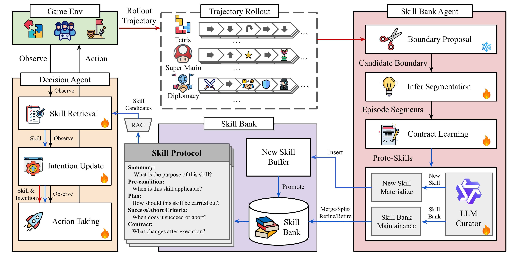
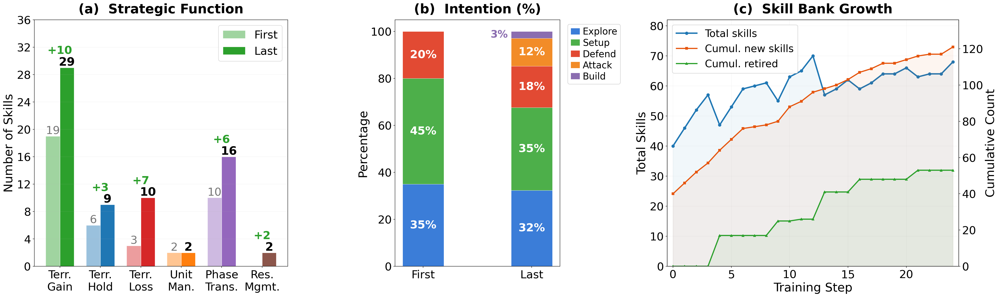

# COS-PLAY: Co-Evolving LLM Decision and Skill Bank Agents for Long-Horizon Game Play

This repository is the official codebase for our paper:

**COS-PLAY: Co-Evolving LLM Decision and Skill Bank Agents for Long-Horizon Game Play**

**Paper:** [arXiv](https://arxiv.org/abs/XXXX.XXXXX)

COS-PLAY is a co-evolution framework in which an LLM decision agent retrieves skills from a learnable skill bank to guide action taking, while an agent-managed skill pipeline discovers reusable skills from the agent's unlabeled rollouts. Built on Qwen3-8B, COS-PLAY achieves over **25.1% average reward improvement** against four frontier LLM baselines on single-player game benchmarks while remaining competitive on multi-player social reasoning games.

<p align="center">
    
</p>

*Overview of COS-PLAY. The decision agent (orange) retrieves skills, updates intentions, and selects actions. After each episode, the skill bank agent (red) segments trajectories, learns contracts, and curates the skill bank (purple) via refinement, merging, splitting, or retirement.*

# About

- Multi-agent co-evolution framework for LLM game agents
- Skill-augmented decision-making with reusable skill bank
- GRPO training with 5 function-specific LoRA adapters
- 6 game environments: 2048, Candy Crush, Tetris, Super Mario Bros, Avalon, Diplomacy

# Table of Contents

- **[About](#about)**
- **[Dependencies](#dependencies)**
- **[Installation](#installation)**
- **[Repository Structure](#repository-structure)**
- **[Running COS-PLAY](#running-cos-play)**
  - [Step 1: Cold-Start Data Generation](#step-1-cold-start-data-generation)
  - [Step 2: Skill Labeling and Extraction](#step-2-skill-labeling-and-extraction)
  - [Step 3: SFT Cold-Start Training](#step-3-sft-cold-start-training)
  - [Step 4: Co-Evolution Training](#step-4-co-evolution-training)
  - [Step 5: Inference and Evaluation](#step-5-inference-and-evaluation)
- **[Baselines](#baselines)**
  - [GPT-5.4](#gpt-54)
  - [Claude 4.6 Sonnet](#claude-46-sonnet)
  - [Gemini 3.1 Pro](#gemini-31-pro)
  - [GPT-OSS 120B](#gpt-oss-120b)
- **[Ablation Study](#ablation-study)**
  - [Single-Player Games](#single-player-games)
  - [Multi-Player Games (Avalon)](#multi-player-games-avalon)
  - [Multi-Player Games (Diplomacy)](#multi-player-games-diplomacy)
- **[Per-Game Training Scripts](#per-game-training-scripts)**
- **[Results](#results)**
- **[Acknowledgement](#acknowledgement)**
- **[Citation](#citation)**

# Dependencies

- **Python** 3.10+
- **PyTorch** 2.1+ with CUDA
- **Qwen3-8B** (base model for decision and skill bank agents)
- **Qwen3-Embedding-0.6B** (for RAG retrieval)
- **vLLM** (for fast inference during training)
- **8 x A100-80GB** GPUs recommended (4 for Decision Agent, 4 for Skill Bank Agent)

**External game environments (not bundled):**

| Game | Source | Setup |
|------|--------|-------|
| 2048, Candy Crush, Tetris | [GamingAgent](https://github.com/lmgame-org/GamingAgent) (LMGame-Bench) | Clone as sibling directory |
| Avalon, Diplomacy | [AgentEvolver](https://github.com/modelscope/AgentEvolver) | Clone as sibling or add to `PYTHONPATH` |
| Super Mario Bros | [Orak](https://github.com/krafton-ai/Orak/tree/release?tab=readme-ov-file) (gym_super_mario_bros) | See [env_wrappers/README.md](env_wrappers/README.md) |

# Installation

### Hardware Requirements

| Use Case | GPU | RAM | Notes |
|----------|-----|-----|-------|
| Full co-evolution training | 8× A100/H100 (80 GB) | 256 GB | GRPO + FSDP + 5 LoRA adapters |
| Single-game training | 1–2× A100 (80 GB) | 64 GB | |
| Inference / evaluation | 1× GPU (24+ GB) | 32 GB | vLLM serving Qwen3-8B |
| API-only baselines | CPU only | 16 GB | GPT-5.4 / Claude / Gemini via API |

### 1. Clone repositories

```bash
mkdir -p cos-play && cd cos-play

# This repo
git clone https://github.com/wuxiyang1996/cos-play.git Game-AI-Agent

# Game environments (cloned as siblings)
git clone https://github.com/lmgame-org/GamingAgent.git        # 2048, Candy Crush, Tetris
git clone https://github.com/modelscope/AgentEvolver.git        # Avalon, Diplomacy
git clone https://github.com/krafton-ai/Orak.git  # Super Mario (optional)
```

### 2. Install dependencies

Pick **one** of the following:

```bash
cd Game-AI-Agent

# Option A: Automated install (recommended — creates conda env + all deps + verification)
bash install/install_main_env.sh

# Option B: pip install (editable mode, for development)
pip install -e .

# Option C: pip install from requirements
pip install -r requirements.txt
```

Option A is recommended because it also installs PyTorch with the correct CUDA version,
sets up GamingAgent, and runs 30+ import verification checks.

For **Super Mario**, install the separate `orak-mario` conda environment:
```bash
bash install/install_orak_mario.sh
```

### 3. Set up API keys

```bash
cp .env.example .env
# Edit .env with your API keys (OpenAI, Anthropic, Google, OpenRouter)
set -a && source .env && set +a
```

### 4. Set PYTHONPATH

```bash
cd ~/cos-play
export PYTHONPATH=$(pwd)/Game-AI-Agent:$(pwd)/AgentEvolver:$(pwd)/GamingAgent:$PYTHONPATH
```

See [install/README.md](install/README.md) for detailed setup, troubleshooting, and
the orak-mario environment guide.

# Repository Structure

```
cos-play/
├── decision_agents/        # LLM decision agent (skill retrieval, action, intention, reward)
├── skill_agents/           # Skill bank pipeline + GRPO training (boundary, segmentation, contracts, maintenance)
├── data_structure/         # Episode, Experience, SubTask data structures
├── rag/                    # RAG retrieval (Qwen3-Embedding-0.6B)
├── trainer/                # Co-evolution training (GRPO + FSDP + Hard-EM + SFT)
├── env_wrappers/           # NL wrappers, Gymnasium adapters, game configs, benchmark runners
├── cold_start/             # Seed trajectory generation
├── labeling/               # Skill labeling pipeline (for cold-start SFT data)
├── inference/              # Inference and evaluation (all post-training scripts)
├── scripts/                # Training scripts (co-evolution, SFT, skill extraction)
├── configs/                # Configuration files (YAML)
├── baselines/              # Frontier LLM baseline evaluation
├── ablation_study/         # Ablation study scripts (Table 1)
└── install/                # Install scripts and requirements for all conda envs
```

Each module has its own README:
[decision_agents](decision_agents/README.md) · [skill_agents](skill_agents/README.md) · [trainer](trainer/README.md) · [env_wrappers](env_wrappers/README.md) · [inference](inference/README.md) · [scripts](scripts/README.md) · [rag](rag/README.md) · [cold_start](cold_start/readme.md) · [labeling](labeling/readme.md)

# Running COS-PLAY

The full pipeline has 5 stages. Each stage produces outputs consumed by the next.

## Step 1: Cold-Start Data Generation

Generate seed trajectories using a teacher model (GPT-5.4). This produces 60 episodes per game.

```bash
# All GamingAgent games (2048, Candy Crush, Tetris)
bash cold_start/run_coldstart_gpt54.sh --episodes 60

# Specific games only
bash cold_start/run_coldstart_gpt54.sh --games tetris candy_crush --episodes 60

# Avalon and Diplomacy (requires AgentEvolver)
bash cold_start/run_coldstart_evolver.sh --games avalon diplomacy --episodes 60

# Super Mario (requires Orak env)
bash cold_start/run_coldstart_orak_mario.sh --episodes 60 -v
```

**Python API:**
```python
python cold_start/generate_cold_start_gpt54.py --games tetris --episodes 5 --resume
```

Rollouts are saved to `cold_start/output/` as JSONL files.

## Step 2: Skill Labeling and Extraction

Label cold-start episodes with structured states, intentions, and skills, then extract a seed skill bank.

```bash
# Label episodes with summary_state, intentions (no skills)
bash labeling/run_labeling.sh --games tetris candy_crush

# Label episodes AND run skill selection + GRPO cold-start data export
bash labeling/run_label_with_skills.sh --one_per_game -v

# Extract skill bank from already-labeled rollouts
bash labeling/run_extract_skillbank.sh --games tetris super_mario
```

**Python API:**
```python
python labeling/label_episodes_gpt54.py --games tetris candy_crush
python labeling/extract_skillbank_gpt54.py --games tetris super_mario -v
```

Labeled episodes are saved to `labeling/output/`. Skill banks are saved as `skill_bank.jsonl`.

## Step 3: SFT Cold-Start Training

Train all 5 LoRA adapters from teacher-labelled data before GRPO. This gives the co-evolution loop a non-random starting point.

The 5 adapters are: `skill_selection`, `action_taking` (Decision Agent), `segment`, `contract`, `curator` (Skill Bank Agent).

```bash
# Sequential: train all 5 adapters one after another (1 GPU)
bash scripts/run_sft_coldstart.sh

# Parallel: train all 5 adapters simultaneously (~5x faster, needs 5 GPUs)
SFT_PARALLEL=1 bash scripts/run_sft_coldstart.sh

# Parallel on specific GPUs
SFT_PARALLEL=1 SFT_GPUS="0 1 2 3 4" bash scripts/run_sft_coldstart.sh

# Train a subset of adapters
SFT_PARALLEL=1 SFT_ADAPTERS="segment contract curator" bash scripts/run_sft_coldstart.sh

# Custom settings
SFT_EPOCHS=5 SFT_LR=1e-4 SFT_PARALLEL=1 bash scripts/run_sft_coldstart.sh
```

**Python API:**
```python
python -m trainer.SFT.train --parallel --gpus 0 1 2 3 4
python -m trainer.SFT.train --adapters segment curator --parallel
```

Adapters are saved to `runs/sft_coldstart/decision/` and `runs/sft_coldstart/skillbank/`.

## Step 4: Co-Evolution Training

Run the main co-evolution loop: collect rollouts → update Skill Bank → GRPO training → repeat.

```bash
# Full co-evolution with SFT warm-start (recommended)
python scripts/run_coevolution.py \
    --load-decision-adapters  runs/sft_coldstart/decision \
    --load-skillbank-adapters runs/sft_coldstart/skillbank \
    --total-steps 25 \
    --episodes-per-game 8

# Custom co-evolution settings
python scripts/run_coevolution.py \
    --total-steps 30 \
    --episodes-per-game 12 \
    --games twenty_forty_eight tetris candy_crush
```

**Per-game training** (after cold-start SFT):

```bash
bash scripts/run_2048.sh                    # 2048
bash scripts/run_tetris.sh                  # Tetris
bash scripts/run_super_mario.sh             # Super Mario Bros (requires Orak)
bash scripts/run_avalon.sh                  # Avalon (requires AgentEvolver)
bash scripts/run_diplomacy.sh               # Diplomacy (requires AgentEvolver)
```

**Multi-player training with external opponents:**

```bash
# Avalon vs GPT-5-mini opponents
bash scripts/train_avalon_vs_gpt5mini.sh

# Diplomacy vs GPT-5-mini opponents
bash scripts/train_diplomacy_vs_gpt5mini.sh
```

**Resume training from a checkpoint:**

```bash
RESUME_FROM_STEP=5 bash scripts/run_tetris.sh
```

## Step 5: Inference and Evaluation

### Run the trained decision agent

```bash
# Qwen3-8B Decision Agent with Skill Bank
python -m scripts.qwen3_decision_agent --games twenty_forty_eight --episodes 8

# Without skill bank (baseline)
python -m scripts.qwen3_decision_agent --no-bank --episodes 3

# Specific game with verbose output
python -m scripts.qwen3_decision_agent --games candy_crush --episodes 5 -v
```

### Best-checkpoint inference (reproducing Table 1)

```bash
# Single-player games
bash inference/run_single_player_inference.sh --game tetris       # step-12 checkpoint
bash inference/run_single_player_inference.sh --game 2048         # step-5 checkpoint
bash inference/run_single_player_inference.sh --game candy_crush  # step-9 checkpoint
bash inference/infer_super_mario_best.sh                          # step-11 checkpoint

# Multi-agent games (self-play, best checkpoint)
bash inference/run_avalon_inference.sh --variant best             # step-5 checkpoint
```

### Diplomacy and Avalon vs GPT-5.4

```bash
# Diplomacy: 10 episodes per power (70 total) vs GPT-5.4
bash inference/run_diplomacy_inference.sh --variant da

# Avalon: 10 episodes per player (50 total) vs GPT-5.4
bash inference/run_avalon_inference.sh --variant da
```

### General inference with any model

```bash
bash inference/run_inference.sh --model Qwen/Qwen3-8B --bank path/to/bank.jsonl \
    --games twenty_forty_eight --episodes 10
```

### Academic benchmark evaluation (Table 7)

```bash
# Check for catastrophic forgetting on MMLU-Pro and Math-500
python -m inference.run_academic_benchmarks --adapter_path runs/best/adapters
```


# Baselines

All baselines use frontier LLMs as gameplay agents via OpenRouter API. Set `OPENROUTER_API_KEY` in your environment before running. Each game has one script that accepts a `--model` flag.

```bash
# Single-player games (any model)
bash baselines/run_tetris_baseline.sh                                          # GPT-5.4 (default)
bash baselines/run_tetris_baseline.sh --model openai/gpt-oss-120b
bash baselines/run_2048_baseline.sh --model google/gemini-3.1-pro-preview
bash baselines/run_candy_crush_baseline.sh --model anthropic/claude-4.6-sonnet-20260217
bash baselines/run_super_mario_baseline.sh --model openai/gpt-oss-120b

# Multi-agent games (controlled model vs GPT-5.4 opponents)
bash baselines/run_avalon_baseline.sh --model gpt-5.4
bash baselines/run_diplomacy_baseline.sh --model google/gemini-3.1-pro-preview
```

**Supported models:** `gpt-5.4`, `openai/gpt-oss-120b`, `google/gemini-3.1-pro-preview`, `anthropic/claude-4.6-sonnet-20260217`

**Customization:** All scripts accept env vars: `EPISODES=N`, `MAX_STEPS=N`, `TEMPERATURE=0.3`, `SEED=42`.

**Analyze results:**
```bash
python baselines/analyze_baselines.py
```

# Ablation Study

Ablation variants from Table 2 in the paper. Each game has one parameterized script with `--adapter` and `--bank` flags.

```bash
# Super Mario (base model and SFT only, requires Orak environment)
bash ablation_study/run_super_mario_ablation.sh --adapter base
bash ablation_study/run_super_mario_ablation.sh --adapter sft

# Avalon (vs GPT-5.4, 8 episodes per player, 40 total)
bash ablation_study/run_avalon_ablation.sh --adapter coevo --bank best    # COS-PLAY (full)
bash ablation_study/run_avalon_ablation.sh --adapter coevo --bank none    # GRPO only
bash ablation_study/run_avalon_ablation.sh --adapter sft   --bank best    # SFT + best bank
bash ablation_study/run_avalon_ablation.sh --adapter sft   --bank first   # SFT + initial bank
bash ablation_study/run_avalon_ablation.sh --adapter sft   --bank none    # SFT only
bash ablation_study/run_avalon_ablation.sh --adapter base                 # Qwen3-8B base

# Diplomacy (vs GPT-5.4, 4 episodes per power, 28 total)
bash ablation_study/run_diplomacy_ablation.sh --adapter coevo --bank best # COS-PLAY (full)
bash ablation_study/run_diplomacy_ablation.sh --adapter base              # Qwen3-8B base

# Run ALL ablations for a game sequentially
bash ablation_study/run_all_ablations.sh --game avalon
bash ablation_study/run_all_ablations.sh --game diplomacy
bash ablation_study/run_all_ablations.sh --game all
```

# Per-Game Training Scripts

Each game has a dedicated training script with game-specific hyperparameters:

| Game | Training Script | Key Env Vars |
|------|----------------|--------------|
| 2048 | `bash scripts/run_2048.sh` | `TOTAL_STEPS=10`, `EPISODES=8` |
| Tetris | `bash scripts/run_tetris.sh` | `TOTAL_STEPS=7`, `EPISODES=8` |
| Candy Crush | Phase 1 of `bash scripts/run_all.sh` | `TOTAL_STEPS=10`, `EPISODES=8` |
| Super Mario | `bash scripts/run_super_mario.sh` | `TOTAL_STEPS=20`, `EPISODES=8` |
| Avalon | `bash scripts/run_avalon.sh` | `TOTAL_STEPS=20`, `EPISODES=20` |
| Diplomacy | `bash scripts/run_diplomacy.sh` | `TOTAL_STEPS=25`, `EPISODES=28` |
| All games (curriculum) | `bash scripts/run_all.sh` | `DEBUG=1`, `RESUME_PHASE=N` |

# Results

<p align="center">
    
</p>

*Skill bank evolution over Diplomacy training: (a) strategic function categories grow richer, (b) intention composition diversifies, (c) active bank stays at 55–70 skills while 121 are discovered and 53 pruned.*

COS-PLAY (Qwen3-8B) achieves **25.1% average improvement** over GPT-5.4 on single-player games:

| Model | 2048 | Tetris | Candy Crush | Super Mario | Avg. |
|-------|------|--------|-------------|-------------|------|
| GPT-5.4 | 1126.6 ± 150.2 | 458.2 ± 203.5 | 532.6 ± 24.8 | 752.0 ± 35.7 | 717.4 |
| Gemini-3.1-Pro | 813.3 ± 143.6 | 372.7 ± 157.7 | 334.3 ± 59.4 | 436.8 ± 86.1 | 489.3 |
| Claude-4.6-Sonnet | 945.0 ± 134.5 | 444.2 ± 182.6 | 328.6 ± 23.8 | 399.5 ± 53.4 | 529.3 |
| GPT-OSS-120B | 1029.5 ± 122.0 | 358.1 ± 139.7 | 334.4 ± 40.5 | 968.5 ± 175.0 | 672.6 |
| **COS-PLAY (8B)** | **1589.0 ± 192.4** | **510.9 ± 199.5** | **648.8 ± 38.8** | **948.9 ± 153.2** | **924.4** |

Multi-player social reasoning (vs GPT-5.4 opponents):

| Model | Avalon Win Rate ↑ | Diplomacy Mean SC ↑ |
|-------|-------------------|---------------------|
| GPT-5.4 | 65.0 ± 14.2 | 4.70 ± 0.35 |
| Gemini-3.1-Pro | 42.0 ± 13.2 | 2.72 ± 0.26 |
| Claude-4.6-Sonnet | 40.0 ± 13.1 | 3.16 ± 0.19 |
| **COS-PLAY (8B)** | **39.0 ± 9.4** | **2.96 ± 0.20** |

All results are reported with 95% confidence intervals, based on 16 evaluation rollouts for single-player games and 10 rollouts per player for multi-player games.

General reasoning (catastrophic forgetting check):

| Model | MMLU-Pro Acc. ↑ | Math-500 EM ↑ |
|-------|-----------------|---------------|
| Qwen3-8B | 61.99% | 46.40% |
| COS-PLAY | 61.15% | 44.60% |

# Acknowledgement

This repository builds on the following open-source projects:
- [GamingAgent](https://github.com/lmgame-org/GamingAgent) — LMGame-Bench (2048, Candy Crush, Tetris)
- [AgentEvolver](https://github.com/modelscope/AgentEvolver) — Avalon, Diplomacy environments
- [Qwen3](https://github.com/QwenLM/Qwen3) — Base model
- [Orak](https://github.com/krafton-ai/Orak/tree/release?tab=readme-ov-file) — Super Mario environment

# Citation

```bibtex
@inproceedings{wu2026cosplay,
  title={Co-Evolving {LLM} Decision and Skill Bank Agents for Long-Horizon Game Play},
  author={Wu, Xiyang and others},
  booktitle={Conference on Language Modeling (COLM)},
  year={2026}
}
```

# License

This project is licensed under the MIT License. See [LICENSE](LICENSE) for details.
